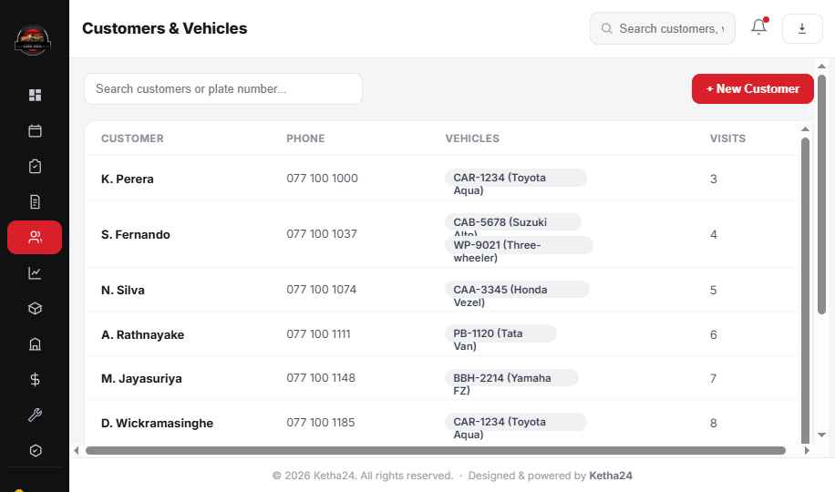
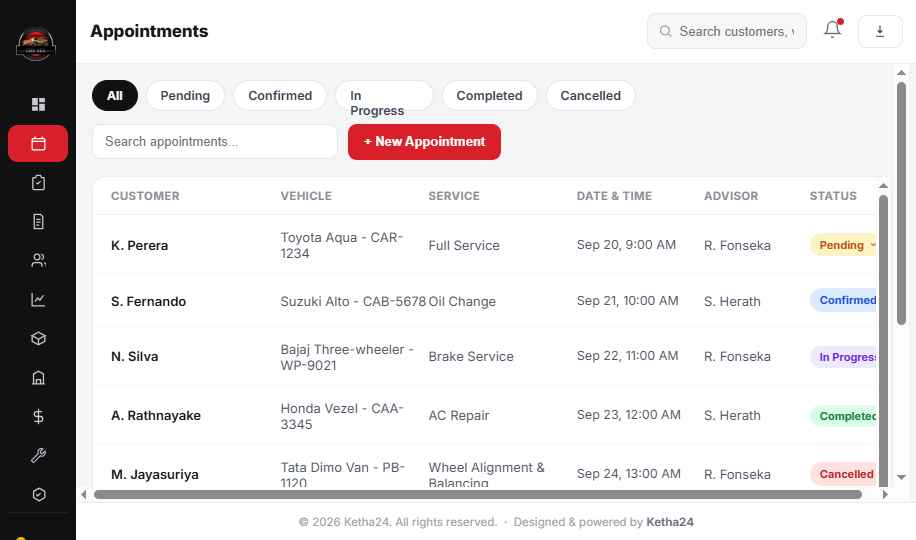
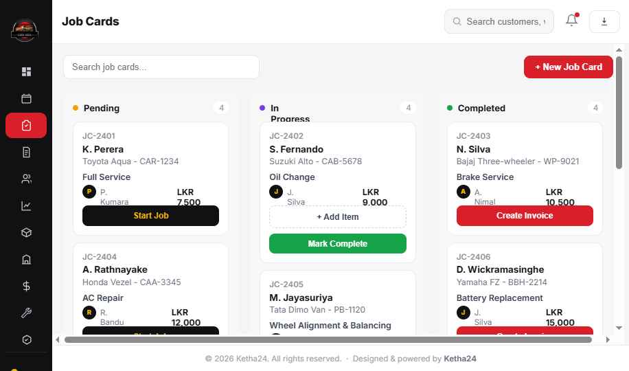
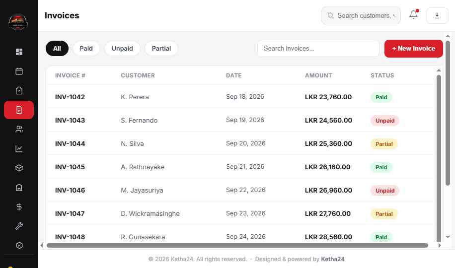
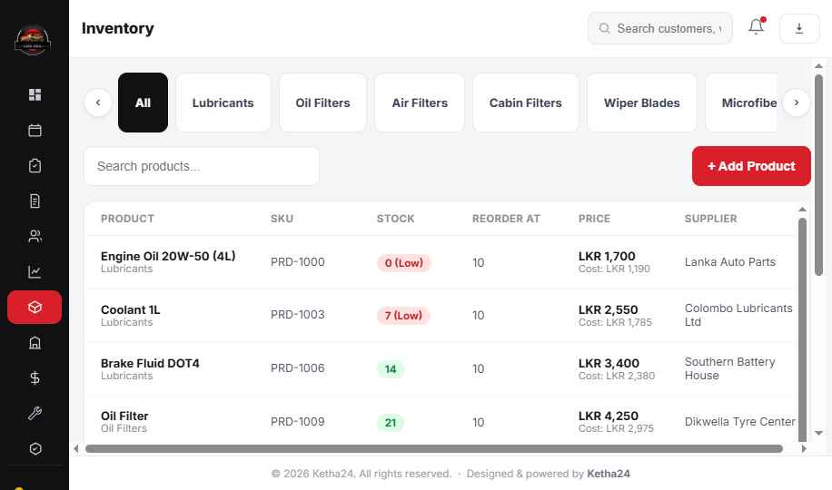
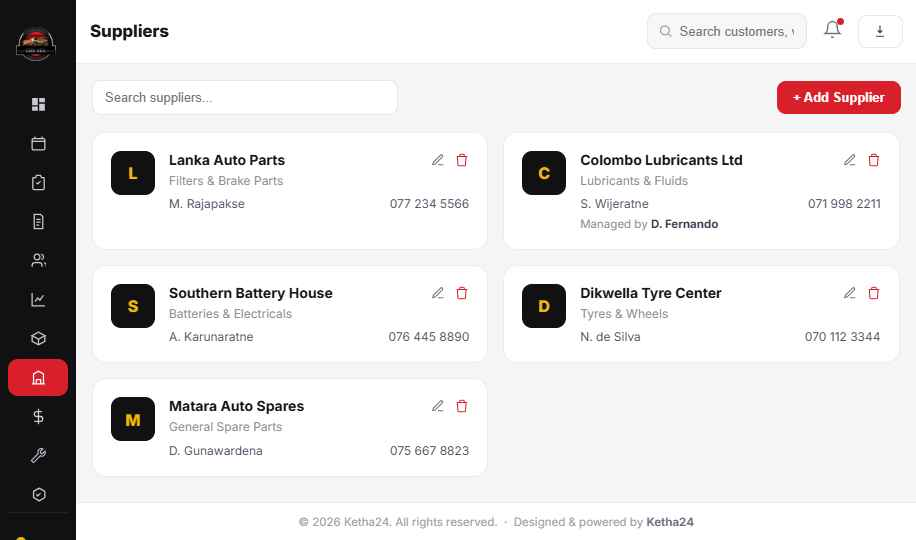
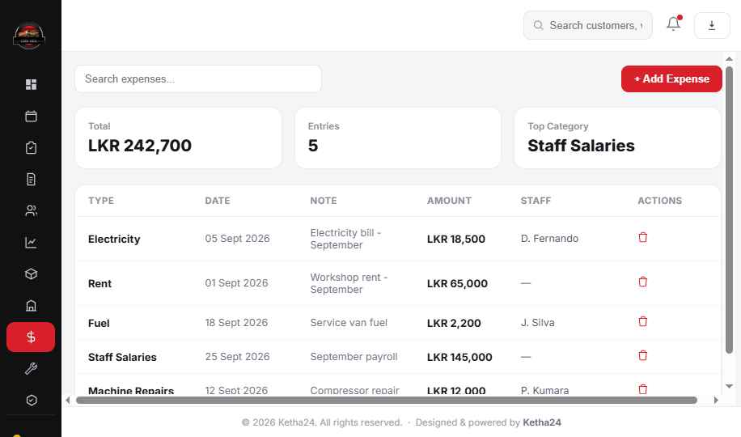
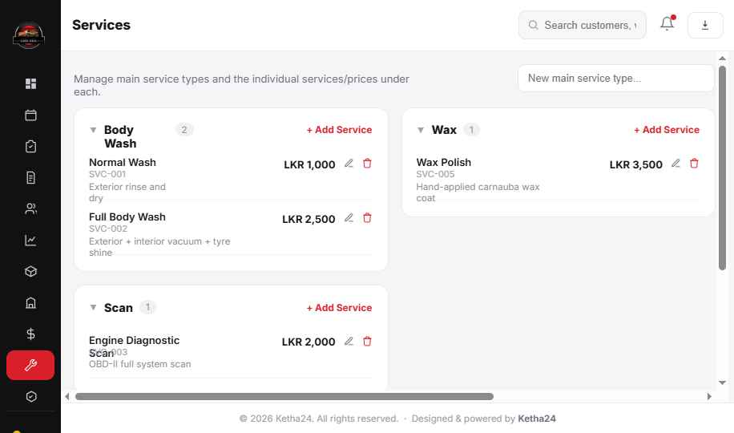
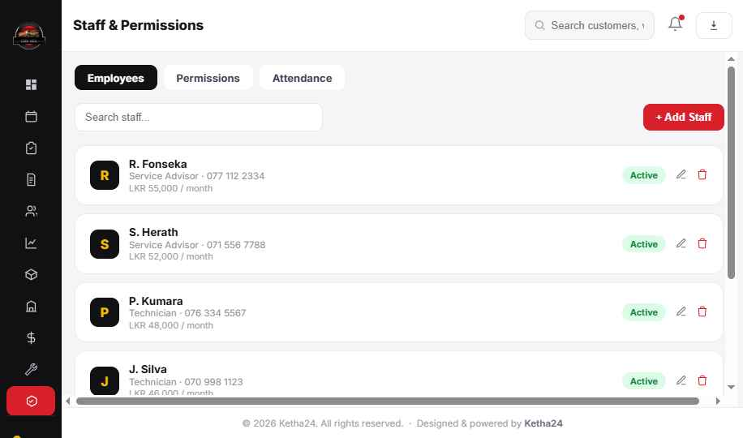
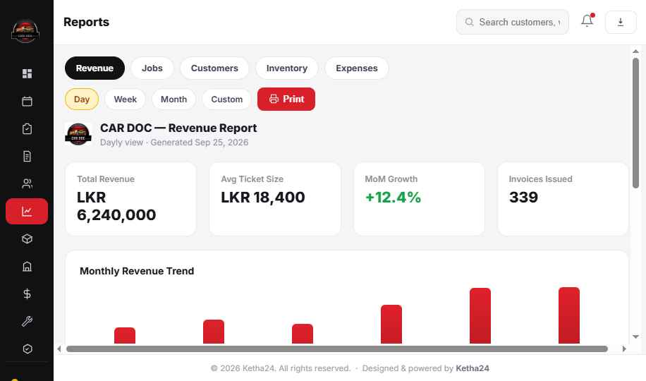

# CAR DOC — Service Center ERP (Design Prototype)

ERP design for **CAR DOC**, a car service center in Dikwella, Sri Lanka. Covers
appointments, job cards, invoicing, inventory/parts, suppliers, expenses, service
catalog, staff & permissions, customer/vehicle records, and dashboard/reporting.

> This repo currently holds **design prototypes**, not a production app. See
> [CLAUDE.md](CLAUDE.md) for the full functional spec and [ARCHITECTURE.md](ARCHITECTURE.md)
> for how the prototype files are wired.

## Screens

| Dashboard | Appointments | Job Cards |
|---|---|---|
|  |  |  |

| Invoices | Inventory | Suppliers |
|---|---|---|
|  |  |  |

| Expenses | Services | Staff |
|---|---|---|
|  |  |  |

| Reports | Customers |
|---|---|
|  |  |

## Status

These are HTML/JS design prototypes (`source/*.dc.html`) built in a proprietary
templating format used only to author the visuals — they are references for layout,
copy, colors, and interaction logic, not runnable outside the original design tool
(they depend on a `support.js` runtime that isn't part of this repo). The plan is to
rebuild this as a real app (React + TypeScript + a real backend/DB) using the spec in
[CLAUDE.md](CLAUDE.md).
